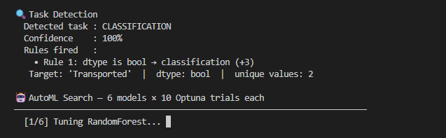
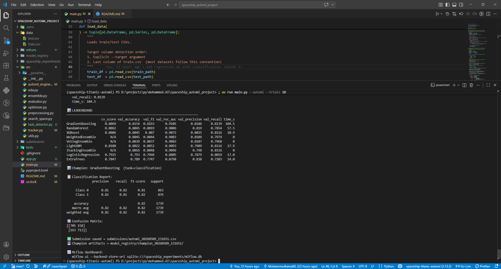

<div align="center">

# 🚀 Spaceship Titanic — AutoML Pipeline

**مسار تعلم آلي مؤتمت بالكامل** يكتشف نوع المهمة تلقائياً، يبحث عن أفضل النماذج، يضبط معاملاتها، ويبني أنظمة ensemble — بدون أي تدخل يدوي.

[](https://github.com/MohammedkamalEL/Spaceship_Titanic_Machine_Learning_Pipeline/actions)


</div>

---

## 📑 الفهرس

- [نظرة عامة](#-نظرة-عامة)
- [هيكل المشروع](#-هيكل-المشروع)
- [المتطلبات](#-المتطلبات)
- [التثبيت](#-التثبيت)
- [التشغيل السريع](#-التشغيل-السريع)
- [أوامر CLI التفصيلية](#-أوامر-cli-التفصيلية)
- [واجهة Streamlit](#-واجهة-streamlit)
- [كيف يعمل AutoML](#-كيف-يعمل-automl)
- [النماذج المدعومة](#-النماذج-المدعومة)
- [النتائج](#-النتائج)
- [الاختبارات](#-الاختبارات)
- [MLflow Dashboard](#-mlflow-dashboard)

---

## 🎯 نظرة عامة

يأخذ هذا المشروع أي ملف CSV ويُخرج أفضل نموذج تنبؤي ممكن **تلقائياً**:

```
البيانات (CSV)  →  اكتشاف التاسك  →  بحث النماذج  →  ضبط Optuna  →  Ensembles  →  بطل 🏆
```

| الميزة | التفاصيل |
|---|---|
| **اكتشاف التاسك** | 6 قواعد مرجّحة مع نسبة ثقة (Classification / Regression) |
| **محرك البحث** | Optuna TPE مع MedianPruner |
| **النماذج** | 6 classification + 8 regression |
| **الـ Ensembles** | Voting + Weighted + Stacking (تلقائية) |
| **التتبع** | MLflow مع SQLite backend |
| **الواجهة** | Streamlit 5-step wizard + CLI كامل |
| **الاختبارات** | pytest + CI/CD عبر GitHub Actions |

---

## 🏗 هيكل المشروع

```
spaceship_automl_project/
│
├── 📂 src/                          ← المكتبة الأساسية
│   ├── task_detector.py             ← اكتشاف التاسك (6 قواعد + confidence)
│   ├── automl_engine.py             ← المحرك الرئيسي — ينسّق كل شيء
│   ├── search_space.py              ← تعريف النماذج وفضاء Optuna
│   ├── optimizer.py                 ← حلقة Optuna TPE لكل نموذج
│   ├── ensemble.py                  ← Voting / Weighted / Stacking
│   ├── evaluator.py                 ← Metrics (Accuracy/F1/RMSE/R²)
│   ├── preprocessing.py             ← SpaceshipFeatureEngineer + ColumnTransformer
│   ├── tracker.py                   ← MLflow logging
│   ├── eda.py                       ← رسوم EDA
│   └── utils.py                     ← إعداد المجلدات
│
├── 📂 tests/                        ← Test suite كامل
│   ├── conftest.py                  ← Fixtures مشتركة
│   ├── test_data_processing/
│   │   └── test_task_detector.py    ← 20 اختبار للـ task detector
│   ├── test_preprocessing/
│   │   └── test_pipeline.py         ← 10 اختبارات preprocessing
│   └── test_models/
│       ├── test_evaluator.py        ← اختبارات الـ metrics
│       └── test_search_space.py     ← اختبارات registry النماذج
│
├── 📂 data/                         ← ضع هنا train.csv و test.csv
├── 📂 model_registry/               ← نماذج محفوظة + model cards
├── 📂 submissions/                  ← ملفات submission لـ Kaggle
├── 📂 spaceship_experiments/        ← MLflow SQLite backend
├── 📂 .github/workflows/
│   └── tests.yml                    ← CI/CD — يشغّل pytest على كل push
│
├── app.py                           ← واجهة Streamlit
├── main.py                          ← CLI entry point
├── pyproject.toml                   ← المتطلبات والإعدادات
└── pytest.ini                       ← إعدادات pytest
```

---

## 💻 المتطلبات

- Python **3.10** أو أحدث
- Windows / macOS / Linux

---

## ⚙️ التثبيت

### الطريقة 1 — باستخدام `uv` (موصى به)

```powershell
# تثبيت uv إذا لم يكن موجوداً
pip install uv

# تثبيت المشروع
uv sync

# تثبيت مع أدوات التطوير (pytest)
uv sync --extra dev
```

### الطريقة 2 — باستخدام `pip` العادي

```powershell
# إنشاء بيئة افتراضية
python -m venv .venv

# تفعيلها
.venv\Scripts\activate          # Windows
source .venv/bin/activate       # macOS / Linux

# تثبيت المتطلبات
pip install -e ".[dev]"
```

### إضافة البيانات

ضع الملفات في مجلد `data/`:

```
data/
├── train.csv    ← بيانات التدريب (مع عمود الهدف)
└── test.csv     ← بيانات الاختبار (بدون عمود الهدف)
```

> تنزيل بيانات Spaceship Titanic: [kaggle.com/competitions/spaceship-titanic](https://www.kaggle.com/competitions/spaceship-titanic/data)

---

## ⚡ التشغيل السريع

```powershell
# 1. تثبيت المتطلبات
uv sync

# 2. تجربة سريعة (10 trials — دقائق)
python main.py --automl --trials 10

# 3. أو شغّل الواجهة المرئية
streamlit run app.py
```

---

## 🖥 أوامر CLI التفصيلية

### الأوامر الأساسية

| الأمر | الوصف |
|---|---|
| `python main.py --automl` | تشغيل AutoML كامل |
| `python main.py --eda` | رسوم EDA فقط |
| `python main.py --all` | EDA + AutoML معاً |

### الخيارات المتاحة

| الخيار | القيمة الافتراضية | الوصف |
|---|---|---|
| `--trials N` | `50` | عدد Optuna trials لكل نموذج |
| `--target COL` | آخر عمود | اسم عمود الهدف |
| `--task TYPE` | `auto` | إجبار نوع التاسك: `classification` أو `regression` |
| `--train PATH` | `data/train.csv` | مسار ملف التدريب |
| `--test PATH` | `data/test.csv` | مسار ملف الاختبار |

### أمثلة عملية

```powershell
# Spaceship Titanic — اكتشاف تلقائي
python main.py --automl --trials 50

# تحديد العمود يدوياً
python main.py --automl --target Transported --trials 30

# مسابقة regression (مثل House Prices)
python main.py --automl --target SalePrice --task regression --trials 50

# بيانات خارجية من مسار مختلف
python main.py --automl --train path/to/train.csv --test path/to/test.csv --trials 20

# EDA ثم AutoML في أمر واحد
python main.py --all --trials 20
```

---

## 🌐 واجهة Streamlit

```powershell
streamlit run app.py
```

يفتح المتصفح تلقائياً على `http://localhost:8501` — بـ 5 خطوات إرشادية:

| الخطوة | الوصف |
|---|---|
| **1. Upload Data** | رفع CSV أو Excel مع عرض إحصائيات جودة البيانات |
| **2. Select Target** | اختيار عمود الهدف مع رسم توزيعه |
| **3. Task Detection** | عرض القواعد ونسبة الثقة + خيار التجاوز اليدوي |
| **4. Train & Tune** | ضبط trials/folds وبدء التدريب مع log مباشر |
| **5. Evaluate** | Leaderboard + charts + تحميل النموذج والـ predictions |

---

## 🤖 كيف يعمل AutoML

### المرحلة 1 — اكتشاف التاسك التلقائي

يفحص `TaskDetector` عمود الهدف بـ 6 قواعد مرجّحة:

| القاعدة | الشرط | التصنيف | الوزن |
|---|---|---|---|
| 1 | dtype هو `bool` | Classification | +3 |
| 2 | dtype هو `object` أو `category` | Classification | +3 |
| 3 | عدد القيم الفريدة ≤ 2 | Classification | +3 |
| 4 | عدد القيم الفريدة ≤ 20 | Classification | +2 |
| 5 | نسبة القيم الفريدة > 5% | Regression | +3 |
| 6a | dtype هو `float` | Regression | +2 |
| 6b | dtype هو `int` وكثافة عالية | Regression | +1 |

**نسبة الثقة** = وزن الفائز ÷ إجمالي الأوزان × 100%

### المرحلة 2 — Feature Engineering

`SpaceshipFeatureEngineer` يستخرج تلقائياً:

| المصدر | Features الجديدة |
|---|---|
| `PassengerId` | `GroupId`, `GroupSize`, `IsAlone` |
| `Cabin` | `CabinDeck`, `CabinNum`, `CabinSide` |
| Spending columns | `TotalSpending`, `HasSpending` |
| `Age` | `AgeGroup` (Child / Teen / YoungAdult / Adult / Senior) |

### المرحلة 3 — البحث والضبط

```
لكل نموذج في search_space:
    Optuna TPE → يجرّب N trial → يختار أفضل hyperparameters
    → يُقيّم على validation set → يُسجّل في MLflow
```

### المرحلة 4 — Ensembles التلقائية

| النوع | الآلية | Meta-learner |
|---|---|---|
| **Soft Voting** | متوسط الاحتمالات / القيم | — |
| **Weighted Voting** | وزن ∝ accuracy أو 1/RMSE | — |
| **Stacking** | تكديس النماذج | LR (classification) · Ridge (regression) |

### المرحلة 5 — اختيار البطل

```python
# Classification  → أعلى val_accuracy
# Regression      → أدنى val_RMSE
champion = max(all_models, key=champion_metric)
```

---

## 📊 النماذج المدعومة

### Classification (6 نماذج + 3 ensembles)

| النموذج | المكتبة | val_accuracy |
|---|---|---|
| 🏆 RandomForest | sklearn | 0.8154 |
| GradientBoosting | sklearn | 0.8045 |
| XGBoost | xgboost | 0.8045 |
| WeightedEnsemble | auto-built | 0.8045 |
| VotingEnsemble | auto-built | 0.8039 |
| LightGBM | lightgbm | 0.8022 |
| StackingEnsemble | auto-built | 0.8016 |
| LogisticRegression | sklearn | 0.7930 |
| ExtraTrees | sklearn | 0.7890 |

### Regression (8 نماذج + 3 ensembles)

| النموذج | المكتبة | Metrics |
|---|---|---|
| RandomForestRegressor | sklearn | RMSE / R² / MAE / MAPE |
| GradientBoostingRegressor | sklearn | RMSE / R² / MAE / MAPE |
| XGBoostRegressor | xgboost | RMSE / R² / MAE / MAPE |
| LightGBMRegressor | lightgbm | RMSE / R² / MAE / MAPE |
| Ridge | sklearn | RMSE / R² / MAE / MAPE |
| Lasso | sklearn | RMSE / R² / MAE / MAPE |
| ElasticNet | sklearn | RMSE / R² / MAE / MAPE |
| ExtraTreesRegressor | sklearn | RMSE / R² / MAE / MAPE |
| VotingEnsemble | auto-built | RMSE / R² / MAE / MAPE |
| WeightedEnsemble | auto-built | RMSE / R² / MAE / MAPE |
| StackingEnsemble | auto-built | RMSE / R² / MAE / MAPE |

---

## 📈 النتائج

### Spaceship Titanic (Classification)

> 🏆 **Champion → RandomForest** — `val_accuracy = 0.8154` · `val_roc_auc = 0.9105`

النموذج البطل وكامل الـ leaderboard يُحفظ تلقائياً بعد كل تشغيل في:

```
model_registry/
└── champion_20240509_143022/
    ├── model.pkl          ← النموذج المدرّب
    ├── engineer.pkl       ← feature engineer
    └── model_card.json    ← leaderboard كاملة + metadata
```

---

## 🧪 الاختبارات

```powershell
# تشغيل كل الاختبارات
pytest

# مع تقرير التغطية
pytest --cov=src --cov-report=term-missing

# تشغيل module محدد
pytest tests/test_data_processing/
pytest tests/test_models/
pytest tests/test_preprocessing/
```

### ما تغطيه الاختبارات

| الملف | عدد الاختبارات | ما يغطيه |
|---|---|---|
| `test_task_detector.py` | 20 | الـ 6 قواعد + confidence + override |
| `test_pipeline.py` | 10 | Feature engineering + no data leakage |
| `test_evaluator.py` | 11 | Metrics classification + regression |
| `test_search_space.py` | 9 | Model registry + instantiation |

---

## 📉 MLflow Dashboard

```powershell
mlflow ui --backend-store-uri sqlite:///spaceship_experiments/mlflow.db
```

افتح المتصفح على: **http://127.0.0.1:5000**

تجد فيه لكل تشغيل: كل نموذج جرّبه + الـ hyperparameters + الـ metrics + النموذج المحفوظ.

---

## 🛠 استكشاف الأخطاء

| المشكلة | الحل |
|---|---|
| `ModuleNotFoundError` | تأكد أنك فعّلت البيئة الافتراضية وشغّلت `pip install -e ".[dev]"` |
| `FileNotFoundError: data/train.csv` | ضع `train.csv` و `test.csv` في مجلد `data/` |
| `Target column not found` | تأكد من اسم العمود أو احذف `--target` ليأخذ آخر عمود تلقائياً |
| Streamlit لا يفتح | تأكد أن المنفذ 8501 غير محجوز، أو شغّل: `streamlit run app.py --server.port 8502` |
| التدريب بطيء | قلّل `--trials` إلى 10 للتجربة السريعة |

---


## 📈 Results

 <p align="center">
   
 </p>

 <p align="center">
   
 </p>

## 📈 Final Results

<video src="img/video.mp4" width="100%" controls>
  Your browser does not support the video tag.
</video>


<div align="center">

**Built with** 🐍 Python · 🤖 Optuna · 📊 MLflow · 🌊 Streamlit · 🔬 scikit-learn

</div>
